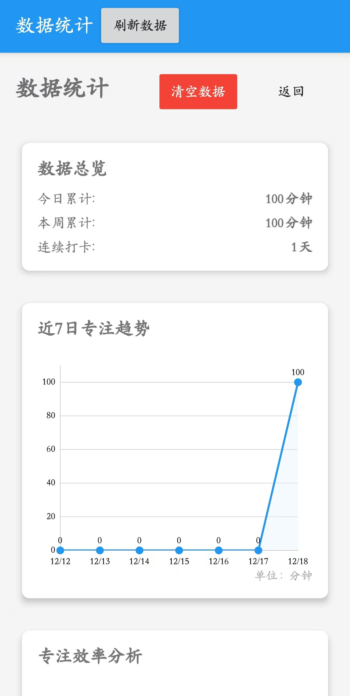

# 🍅 Fclock - 番茄钟 & 白噪音应用

一款集成了番茄工作法和白噪音功能的 Android 应用，帮助您高效学习与专注。

## ✨ 主要特性

### 📊 **番茄工作法**
- ✅ **25分钟** 专注学习计时
- ✅ **5分钟** 休息计时
- ✅ 周期性时间记录
- ✅ 学习数据统计与分析

### 🎵 **白噪音环境**
- 🌊 **4种精选白噪音**：
  - 雨声
  - 海浪
  - 森林
  - 篝火
- 🔊 音量独立调节

### 📈 **数据统计**
- 📅 每日/每周/每月学习时长统计
- 📊 可视化数据图表
- 📋 历史记录查看

## 🚀 快速开始

### 使用方法
1. 选择喜欢的白噪音
2. 开始25分钟番茄钟
3. 专注学习，直到计时结束
4. 休息5分钟后继续下一个周期

### 界面说明
- **主界面**：计时器控制、白噪音选择
- **统计界面**：学习数据可视化

## ⚠️ 已知问题

以下是正在积极修复的问题：

### **问题1：统计功能异常**
- **现象**：在未存储任何学习记录时，点击"查看统计数据"会导致应用意外退出
- **临时解决方案**：至少完成一个番茄钟后再查看统计数据
- **状态**：🔧 **修复中**

### **问题2：数据显示不同步**
- **现象**：在统计界面清除数据后，返回主界面时"已完成：*个番茄钟"未及时归零
- **临时解决方案**：重启应用
- **状态**：🔧 **修复中**

## 📱 应用截图

| 主界面 | 统计界面1 | 统计界面2 |
|--------|----------|----------|
|  |  |  |

## 📥 下载安装

### 源代码编译
```bash
git clone https://github.com/lu6xun/Fclock.git
cd Fclock
# 使用 Android Studio 打开项目
